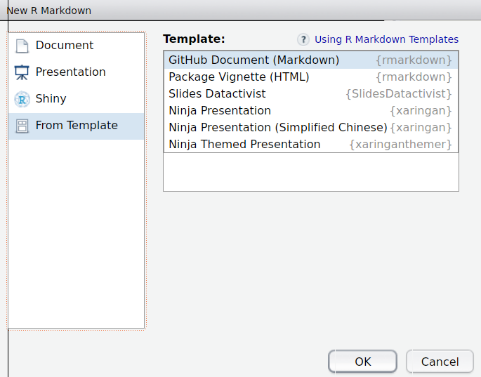
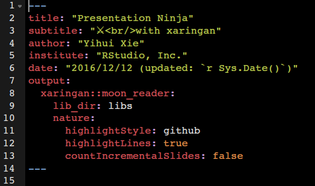
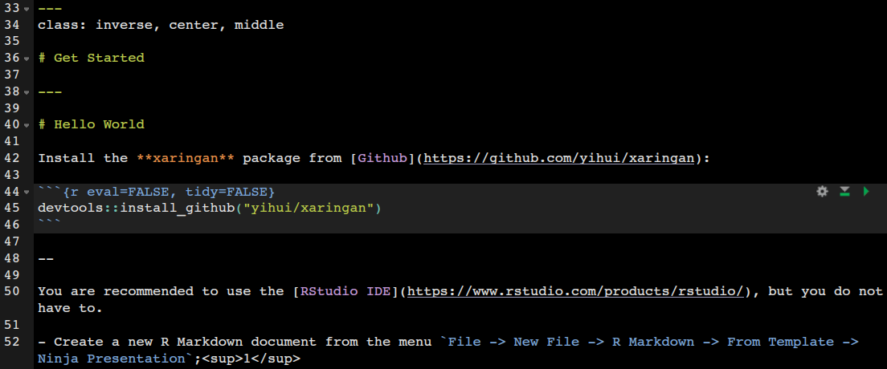
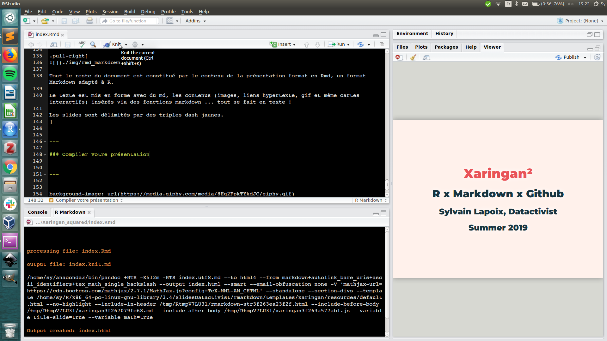

layout: true
  

`r paste0("<div class='my-footer'><span>", params$event, "</span> <center><div class=logo></center></span></div>")`

---

class: center, middle

Ces slides en ligne : `r paste0("https://sylvainlapoix.github.io/", params$slug)`

Sources : `r paste0("https://github.com/sylvainlapoix/", params$slug)`


Of course, les productions de Datactivist sont librement réutilisables selon les termes de la licence [Creative Commons 4.0 BY-SA](https://creativecommons.org/licenses/by-sa/4.0/legalcode.fr).

<BR>
<BR>


---

background-image: url(https://media.giphy.com/media/26gJztRCkcW8meI3C/giphy.gif)
class: center, top, inverse
# 0. Choisir Xaringan ?


---

### Intro
.red[[Xaringan](https://github.com/yihui/xaringan)] est un package R développé par Yihui Xie permettant d'utiliser les fonctionnalités de l'outil de présentation Javascript [remark.js](https://remarkjs.com/) dans R et d'y ajouter les spécificités de ce langage (sortie console, dataviz, etc.). Son nom est inspiré de celui [d'un dōjutsu de Naruto](https://naruto.fandom.com/fr/wiki/Sharingan) disposant de deux capacités :
1. *"l'œil de la perspicacité"* ;
2. *"l'œil de l'hypnose"*.

Je ne vous souhaite rien de moins avec vos prez.

#### Atouts (par rapport à un outil de prez classique)
* lisibilité : Markdown + R (et un tout petit peu de CSS si on veut) ;
* versatilité : texte, graph, images, URLs, code R, HTML, Javascript ou CSS en entrée et, en sortie, HTML, PDF, Bar Mitsvah ... ;
* reproductibilité : chaque prez repose sur un simple .Rmd accompagné de fichiers sources permettant de reproduire, réutiliser et adapter.

--

**Et on peut y mettre des GIFs.**

---

background-image: url(https://media.giphy.com/media/l0Hlxht5Nq8683Sz6/giphy.gif)
class: center, top, inverse

# 1. Créer une présentation

---

### Installer les outils nécessaires

L'interface la plus naturelle pour utiliser Xaringan est [Rstudio](https://www.rstudio.com/) (qui permet notamment de gérer les fichiers et le git).

Xaringan dépend de plusieurs packages courants (Rcpp, markdown, stringr ou encore htmltools). Si vous avez installé le tidyverse, vous en êtes déjà équipé·e·s (mais bon [installez-le quand même](https://www.tidyverse.org/), ça ne pourra que vous servir).

Une fois ces précautions prises, vous pouvez lancer l'installation de Xaringan lui-même  :

```{r eval=FALSE}
install.packages('xaringan')
```

Encore mieux, vous pouvez installer à la place le package permettant de faire des slides chartées Datactivist :

```{r eval=FALSE}
devtools::install_github("datactivist/slides_datactivist")
```


--

Au passage, vérifiez que votre R est à jour en regardant la version avec la fonction  : `R.version()`. La version la plus récente à date est la 3.6.1.

---

### Créer un nouveau projet

Dans le menu "File", sélectionnez *New project* et les options suivantes : New Directory / Empty project.

Vous serez alors invité·e·s à nommer le projet et choisir son emplacement :
* choisissez un emplacement pratique et logique (i.e. : que vous retrouverez facilement) ;
* donnez à votre projet un nom compact sans caractère spéciaux, accents ou espace (préférez les "-" et "_") ;
* cochez la case "Create a git repository", ça vous servira plus tard.

--

Vous devriez alors avoir dans votre dossier :
* **un fichier .Rproj** : qui contient les paramètres de votre projet ;
* **un fichier .gitignore** : dont nous parlerons plus tard.
* **un fichier .Rhistory** : qui apparaîtra dès que vous faîtes un truc et vous sert à garder l'historique des commandes utilisées.


---

### Créer un nouveau Rmd

Vous pouvez maintenant créer votre fichier source en R Markdown (abrégé Rmd) : dans le menu "File", sélectionnez *New file* puis *R Markdown*.

Ici, les options qui nous intéressent sont dans les templates : **"Ninja Presentation"** ou **"Slides Datactivist"** (le thème Xaringan *parfum Datactivist* concocté par Joël) permettront de créer le fichier source de notre présentation :



---

### Le fichier source

Le fichier source est composé de plusieurs parties et écrit suivant une grammaire propre mais très simple.

Au tout début se trouve **le YAML**, codé dans [le langage du même nom](https://fr.wikipedia.org/wiki/YAML), qui paramètre le document.

C'est grâce au YAML que nous pourrons modifier l'entête mais aussi les pieds de page, appeler d'autres polices, etc. Il est délimité en haut et en bas par un triple dash bleu :

.center[]
---
### Le fichier source

.center[]

Tout le reste du document est constitué par le contenu de la présentation format en Rmd, un format Markdown adapté à R.

Le texte est mis en forme avec du md, les contenus (images, liens hypertexte, gif et même cartes interactifs) insérés via des fonctions markdown ... tout se fait en texte !

Les slides sont délimités par des triples dash jaunes.

---

### Compiler votre présentation

Pour "voir" le résultat, vous devez *compiler* votre présentation. C'est-à-dire lancer le processus d'interprétation de votre fichier Rmd en fichier de présentation HTML. Pour cela, il vous suffit de cliquer sur le bouton **Knit** dans la barre supérieure de votre document.

Un aperçu apparaît à droite dans le "Viewer", où vous pouvez naviguer `r emo::ji("sunglasses")` :




---

background-image: url(https://media.giphy.com/media/CovFciJgWyxUs/giphy.gif)
class: center, top, inverse

# 2. Mettre sa présentation en forme

---

background-image: url(https://media.giphy.com/media/p668TRpM2r8bK/giphy.gif)
class: center, top, inverse

# 3. Ajouter du contenu

---

background-image: url(https://media.giphy.com/media/l4FGBILjNaCtLious/giphy.gif)
class: center, top, inverse

# 4. Rendre ses prezs réplicables

---

background-image: url(https://media.giphy.com/media/905GG7MjDw61q/giphy.gif)
class: center, top, inverse

# 5. GIT it to the next level

---

background-image: url(https://media.giphy.com/media/J3Ao5L98X8oms/giphy.gif)
class: center, top, inverse

# 6. Fonctionnalités avancées

---

background-image: url(https://media.giphy.com/media/10vA3MTGTKeb16/giphy.gif)
class: center, top, inverse

# 7. Adapter et créer son propre thème


---


background-image: url(https://media.giphy.com/media/8Hg2FpkTYkdJC/giphy.gif)
class: center, top, inverse

# Patience les chatons, ça arrive

